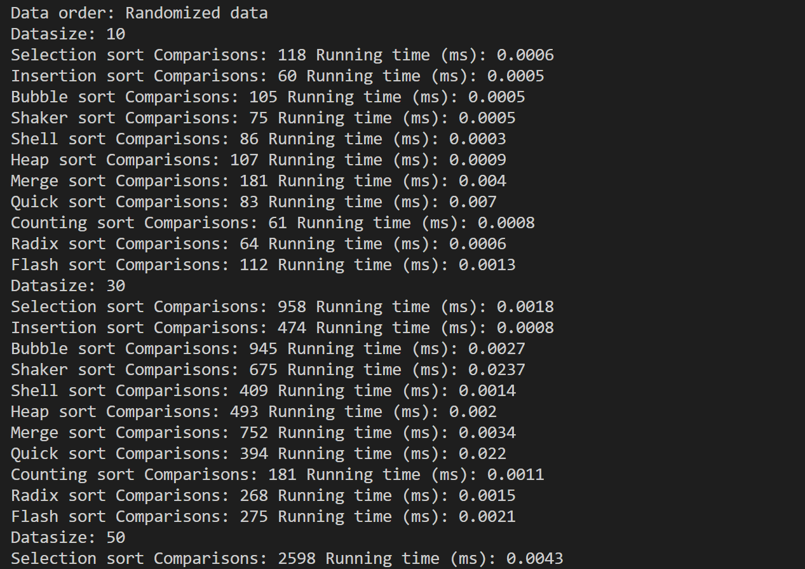

# DATA STRUCTURE AND ALGORITHM - LAB 3 - 2023

## Introduction

This is a project for Data structure and Algorithm Lab. In this project, 11 sorting algorithms are implemented:

<details>
<summary>List of algorithms implemented</summary>

- [Selection Sort](SOURCE/algorithms/selectionSort.cpp)
- [Insertion Sort](SOURCE/algorithms/insertionSort.cpp)
- [Bubble Sort](SOURCE/algorithms/bubbleSort.cpp)
- [Shaker Sort](SOURCE/algorithms/shakerSort.cpp)
- [Shell Sort](SOURCE/algorithms/shellSort.cpp)
- [Heap Sort](SOURCE/algorithms/heapSort.cpp)
- [Merge Sort](SOURCE/algorithms/mergeSort.cpp)
- [Quick Sort](SOURCE/algorithms/quickSort.cpp)
- [Counting Sort](SOURCE/algorithms/countingSort.cpp)
- [Radix Sort](SOURCE/algorithms/radixSort.cpp)
- [Flash Sort](SOURCE/algorithms/flashSort.cpp)
</details>

## Project structure

All the code files are in [SOURCE](SOURCE/) directory.

- 11 algorithms are in [SOURCE/algorithms](SOURCE/algorithms/) directory.

- [```sort_execute.cpp```](SOURCE/sort_execute.cpp) warps all algorithms with same syntax ```sort(int arr[], int N, int algorithmID)```. It should be a class called ```Sort```, but I was so lazy to do that.

- [```DataGenerator.cpp```](SOURCE/DataGenerator.cpp) file is for generate array. It is given by my teacher.

- [```overview.cpp```](SOURCE/overview.cpp) will give an overview about all algorithms.

- [```sort.cpp```](SOURCE/sort.cpp) allows user to choose algorithm to sort array, and compare two algorithms when sorting the same array.

[script](script/) directory contains all scripts of this project.

- [```buid_overview.sh```](script/build_overview.sh) to build [```overview.cpp```](SOURCE/overview.cpp).

- [```build_sort.sh```](script/build_sort.sh) to build [```sort.cpp```](SOURCE/sort.cpp).

- [```initFiles.py```](script/initFiles.py) for creating 22 algorithms' files, and [```sort_execute.cpp```](SOURCE/sort_execute.cpp).

- **All the scripts have to be moved to root before running.**

## [overview.cpp](SOURCE/overview.cpp)

### Build

Stay at root ```/```, and build by command (saved in [```buid_overview.sh```](script/build_overview.sh))

```sh
g++ SOURCE/algorithms/*.cpp SOURCE/DataGenerator.cpp SOURCE/helpler.cpp SOURCE/sort_execute.cpp SOURCE/overview.cpp -o bin/overview
```

### Run

```sh
./bin/overview
```



The result can be saved to file by

```sh
./bin/overview examplename.csv
```

Change the size of arrays here

```cpp
int DATA_SIZE_TESTS[6] = {10000, 30000, 50000, 100000, 300000, 500000};
```

The ```DEBUG``` flag is turned on, make the size reduced 1000 times

```cpp
#define DEBUG

#ifdef DEBUG
N /= 1000;
#endif
```

Turn off this flag, and re-build to sort in real size.

## [```sort.cpp```](SOURCE/sort.cpp)

### Build

Stay at root ```/```, and build by command (saved in [```build_sort.sh```](script/build_sort.sh))

```sh
g++ SOURCE/algorithms/*.cpp SOURCE/DataGenerator.cpp SOURCE/Experiment.cpp SOURCE/helpler.cpp SOURCE/sort_execute.cpp SOURCE/sort.cpp -o bin/sort
```

### Run

There are 5 commands to run this file

- Command 1: Run a sorting algorithm on the given input data

```
./bin/sort -a [Algorithm] [Input file] [Output parameter(s)]
```

For example

```sh
./bin/sort -a radix-sort input.txt -time
```

- Command 2: Run a sorting algorithm on the data generated automatically with specified size and order

```
./bin/sort -a [Algorithm] [Input size] [Input order] [Output parameter(s)]
```

For example

```sh
./bin/sort -a selection-sort 50 -rand -comp
```

- Command 3: Run a sorting algorithm on ALL data arrangements of a specified size

```
./bin/sort -a [Algorithm] [Input size] [Output parameter(s)]
```

For example

```sh
./bin/sort -a selection-sort 50 -both
```

- Command 4:  Run two sorting algorithms on the given input

```
./bin/sort -c [Algorithm 1] [Algorithm 2] [Input file]
```

For example

```sh
./bin/sort -c heap-sort merge-sort input.txt
```

- Command 5: Run two sorting algorithms on the data generated automatically

```
./bin/sort -c [Algorithm 1] [Algorithm 2] [Input size] [Input order]
```

For example

```sh
./bin/sort -c quick-sort merge-sort 100000 -nsorted
```

### Input arguments

| Field               | Value       | Explain                                                       |
|---------------------|-------------|---------------------------------------------------------------|
| Mode                | -a          | Algorithm mode                                                |
|                     | -c          | Comparison mode                                               |
| Algorithm name      | bubble-sort | Lowercase, words are connected by "-"                         |
|                     | quick-sort  |                                                               |
| Input size          | 50          | any interger value, < 1e6                                     |
| Input order         | -rand       | randomized array                                              |
|                     | -nsorted    | nearly sorted array                                           |
|                     | -sorted     | sorted array                                                  |
|                     | -rev        | reversed sorted array                                         |
| Output parameter(s) | -time       | get running time                                              |
|                     | -comp       | get number of comparisons used in running time                |
|                     | -both       | get both values                                               |
| Input file          | input.txt   | any name. First line: array size n; Second line: n intergers |

# Acknowledgement

- Teacher: Mr. Thanh - Phuong Nguyen, Ph.D

- Lab supervisor: Mr Huy - Thong Bui, M.Sc

- This is invidual project.